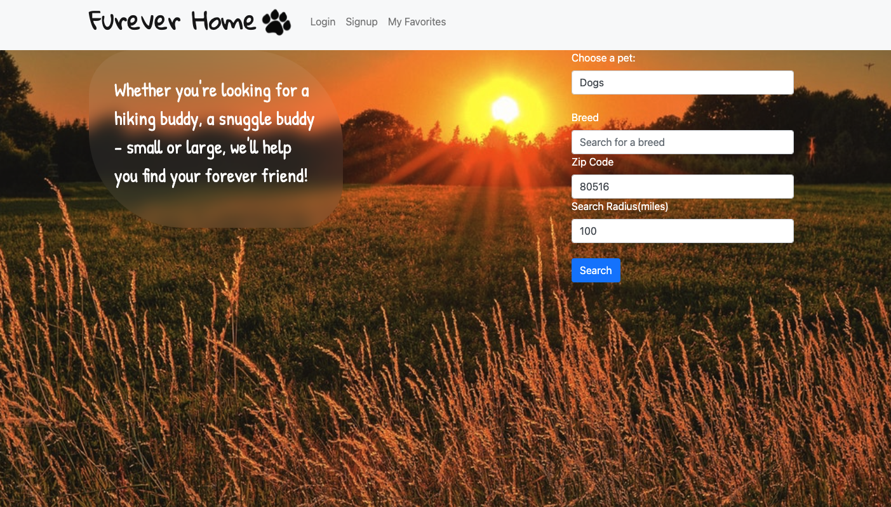
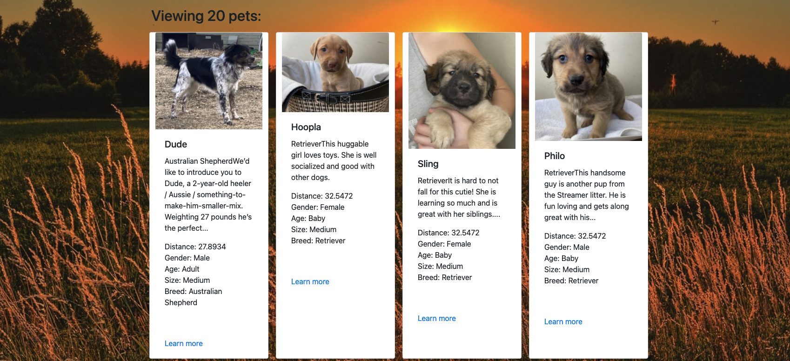

## Table of Contents

- [Installation Guide](#installation)
- [Instructions](#instructions)
- [Credits](#credits)
- [License](#license)
- [Questions](#questions)
- [Contributing](#contributing)
- [Tests](#tests)

## Deployed Link

[FurEverHome.info](https://fureverhome.info)

## App Images

## Installation Guide

Fork the repository and then open the app using npm run develop.

## Instructions

Use this app to find a Furever friend near you! Just enter in what kind of pet you are looking for, and what area and let the magic happen. All list of pets will be populated so you can make them your!

## Credits

[Tifanny Github](https://github.com/trivera777)  
[Satish Github](https://github.com/satishiyer31) 
[Randy Github](https://github.com/ARevampedLifeCoding)

## License

MIT License
Copyright (c) 2021, Tifanny, Satish and Randy

                Permission is hereby granted, free of charge, to any person obtaining a copy
                of this software and associated documentation files (the "Software"), to deal
                in the Software without restriction, including without limitation the rights
                to use, copy, modify, merge, publish, distribute, sublicense, and/or sell
                copies of the Software, and to permit persons to whom the Software is
                furnished to do so, subject to the following conditions:

                The above copyright notice and this permission notice shall be included in all
                copies or substantial portions of the Software.

                THE SOFTWARE IS PROVIDED "AS IS", WITHOUT WARRANTY OF ANY KIND, EXPRESS OR
                IMPLIED, INCLUDING BUT NOT LIMITED TO THE WARRANTIES OF MERCHANTABILITY,
                FITNESS FOR A PARTICULAR PURPOSE AND NONINFRINGEMENT. IN NO EVENT SHALL THE
                AUTHORS OR COPYRIGHT HOLDERS BE LIABLE FOR ANY CLAIM, DAMAGES OR OTHER
                LIABILITY, WHETHER IN AN ACTION OF CONTRACT, TORT OR OTHERWISE, ARISING FROM,
                OUT OF OR IN CONNECTION WITH THE SOFTWARE OR THE USE OR OTHER DEALINGS IN THE
                SOFTWARE.
                For more information, please refer to <https://tlo.mit.edu/>

---

## Questions

If you have any questions or concerns reach me on [Github](https://github.com/trivera777) or through email at <arevampedlifecoding@gmail.com>

## Contributing

[Tifanny Github](https://github.com/trivera777)  
[Satish Github](https://github.com/satishiyer31) 
[Randy Github](https://github.com/ARevampedLifeCoding)

## Tests

Not at this time.
